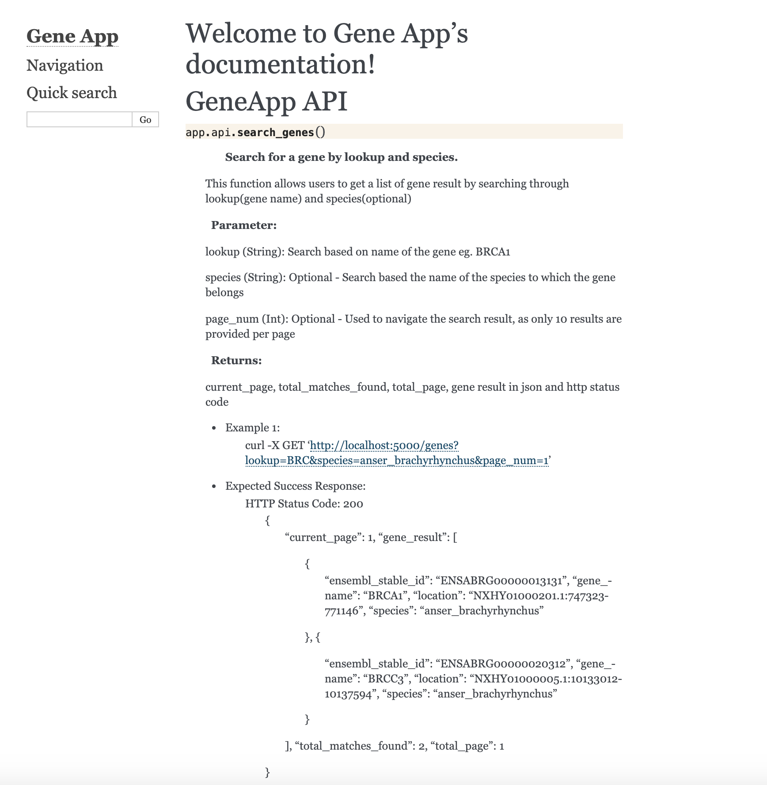

## Deployment

- **Deploy:** The application can be automatically deployed to the Staging/Production environment when there is a code/PR merged to the master branch. Tools like Jenkins helps us to automate the process to build, run automated test, package the application and deploy it to the server. 
- **Monitor:** Once the web app is available for the public, we can continuously monitor through Nagios to check the availability of the webserver. Individual API endpoints can also be tested and monitored in regular intervals using [Postman API Monitor](https://www.getpostman.com/api-monitor) and other tools. 
- **Scaling:** The scaling of the application can be achieved through various mechanism such as scaling at the network, web server and at the database level. We can do a load/stress to understand the durability of each of the component roughly. Some of the ways to scale the Database - have Master/Slave configuration, Database Sharding, Using NoSQL engine that scales very well. Another simple and effective mechanism is to have a cache at different levels - including Database cache (through MemCached/Redis), code cache. 
- **Auto-Scaling:** Web application deployed in the cloud allows us to scale as and when it is required. Services such as AWS EC2, ECS or Kubernetes will enable us to auto-scale the application when there is high demand. Making it easy for the DevOps not only to scale but also recover and heal by auto-deploying new server/container if a node is non-responsive.
- **Docker:** We can package the application and use `Dockerfile` to specify all the dependencies and configurations. It allows us to deploy multiple lightweight containers - [More about deployment on containers](https://blog.miguelgrinberg.com/post/the-flask-mega-tutorial-part-xix-deployment-on-docker-containers)  

## Testing

### Unit Tests

To perform automated tests, we use Unit testing. It allows us to make sure each component is working properly, and new code changes don't break the application. 

Covers the following scenarios
- Request with no input
- Two characters in the 'lookup' parameter
- Invalid characters in the 'lookup' parameter
- Invalid method for the API
- Request with necessary parameter

Use the following command to run the automated testing:

    ./test.sh
    
### Manual Testing

During the development, endpoint was tested manually using the [Postman API Client](https://www.getpostman.com/product/api-client)

As mentioned earlier, whenever there is a new deployment, we can run third-party tools to test and monitor endpoints regularly on the Production server.

### Code Review

Not all the errors are caught using Automated testing. Logical errors can impact the application to deliver an incorrect response. While developing the application with team, we can employ a code review process with fellow developers to find the errors and reduce them.

## Documentation

The project uses Sphinx documentation. From the functions and class, Sphinx can autogenerate the document in a different version - html in this instance.  The configuration for the autogeneration is available in `docs/source/conf.py`. The newly created documentation for the API can be viewed in [docs/build/html/index.html#app.api.search_genes](docs/build/html/index.html#app.api.search_genes) 

Reference used for the documentation

- [Sphinx-doc](https://www.sphinx-doc.org/en/master/)
- [Python Documentation using Sphinx](https://www.patricksoftwareblog.com/python-documentation-using-sphinx/)
- [A Simple Tutorial on How to document your Python Project using Sphinx and Rinohtype](https://medium.com/@richdayandnight/a-simple-tutorial-on-how-to-document-your-python-project-using-sphinx-and-rinohtype-177c22a15b5b)